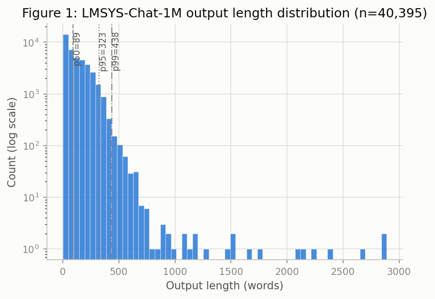
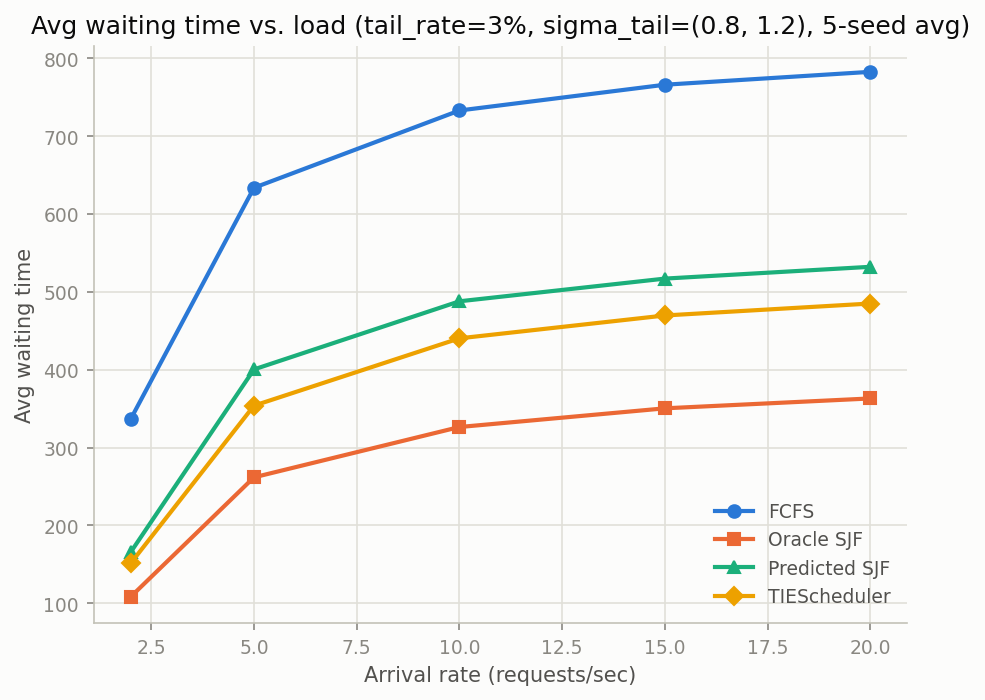
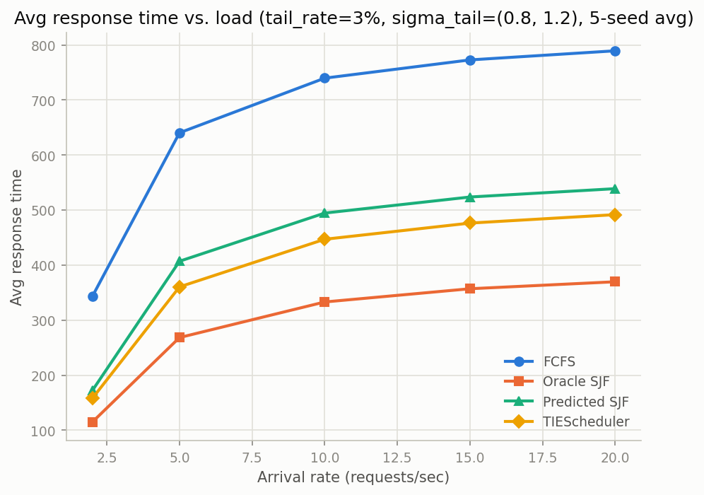
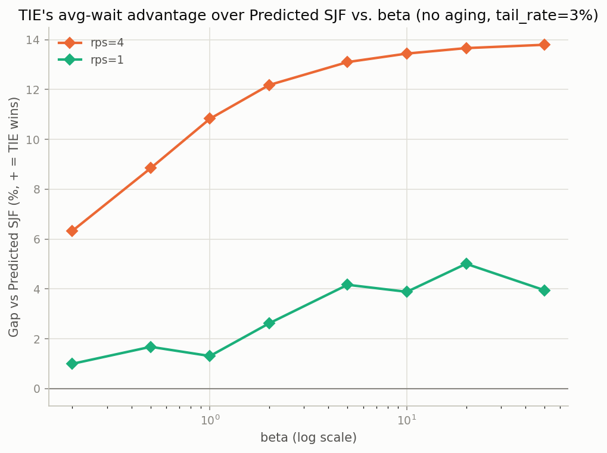
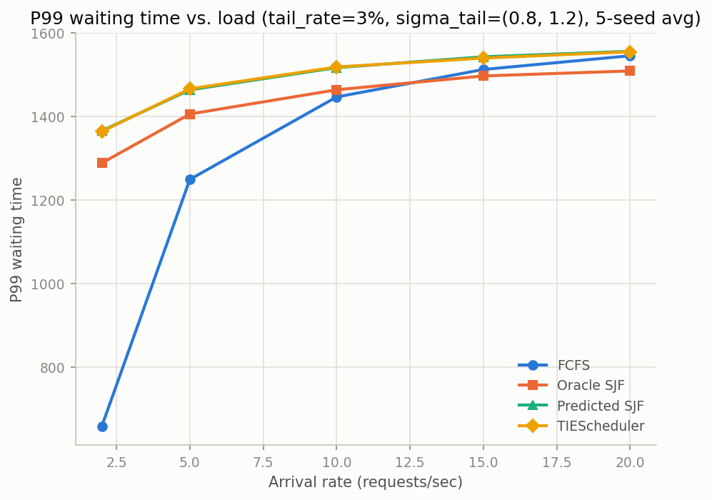
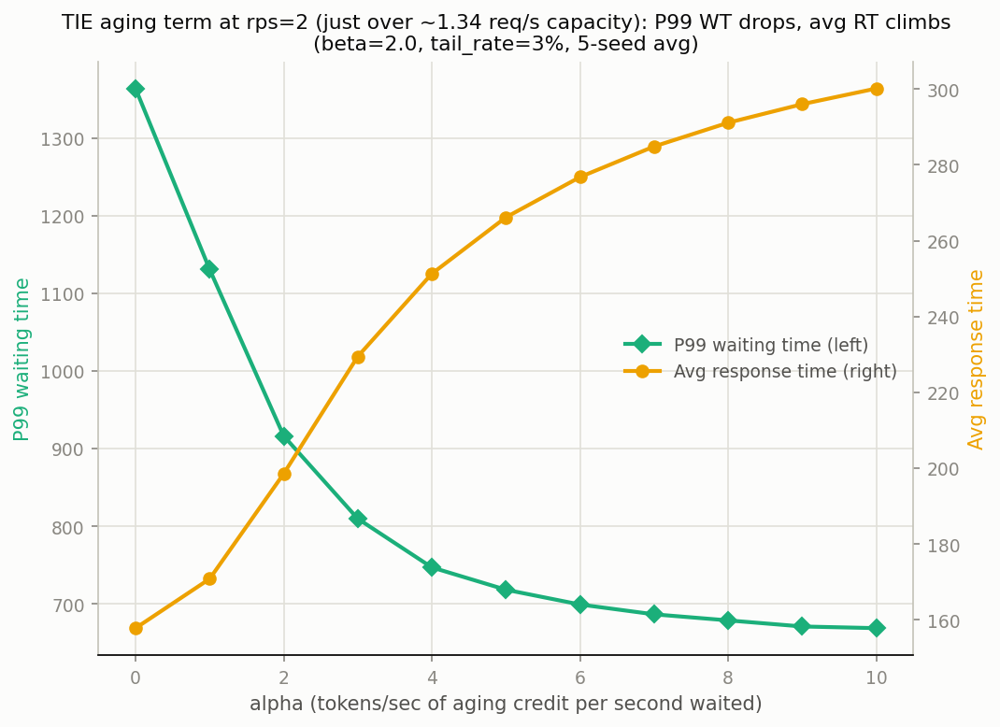

# LLM Inference Scheduling under Prediction Uncertainty: A Long-Tail Risk-Aware Scheduler

CS5800 Final Project Report

---

## 1. Background

### 1.1 The problem

Modern LLM inference servers (vLLM, TensorRT-LLM, Orca, etc.) serve many concurrent requests by batching them together on the GPU. Because GPU memory limits how many requests can be decoded at once (a fixed batch capacity `B`), the server must repeatedly decide **which waiting request to admit next** whenever a batch slot frees up. This is a scheduling problem in the classical sense — but it differs from classical CPU scheduling in ways that make the standard toolkit only partially applicable.

### 1.2 How this differs from classical CPU scheduling

| | Classical CPU scheduling | LLM inference scheduling |
|---|---|---|
| "Job length" | CPU burst time; often has exploitable structure (repeated jobs, syscall patterns) | Number of output tokens the model will generate — depends on the *content* of the response, unknown until the response is finished |
| Preemption | Cheap (context switch, microseconds) | Expensive/awkward — a request's KV-cache state must be kept resident or paged out; there is no free "pause and resume later" |
| Unit of work | Single-job CPU time slice | A batched forward pass serves many requests' next token simultaneously — "waiting" means "not yet admitted into the batch," not "CPU idle" |
| Job-size distribution | Often close to exponential/light-tailed | Heavy-tailed (our own LMSYS data: skewness ≈ 2.9 — a handful of very long generations dominate the tail) |

### 1.3 Why this is hard

The classical fix for "unknown job length" (Shortest-Job-First, SJF) requires knowing the length in advance. In LLM serving, the only thing available at scheduling time is a **prediction** of the output length (either from a trained model, e.g. ELIS's BGE-based predictor, or, absent a real predictor, from an assumption about how good that prediction typically is). Three difficulties compound:

1. **Prediction error is itself heavy-tailed and asymmetric.** A generation length is bounded below (≥1 token) but unbounded above, so predictors are far more likely to catastrophically *underestimate* a long response than to catastrophically overestimate a short one. A scheduler that trusts point estimates (Predicted SJF) will occasionally seat a request it thinks is short but that turns out to be very long, occupying a batch slot far longer than expected and delaying everyone behind it — a head-of-line (HOL) blocking effect specific to this domain.
2. **Optimizing the average trades off against fairness.** Any SJF-family policy systematically deprioritizes long requests. Under sustained load this can starve them indefinitely, which is the classical CPU-scheduling aging problem, but here it interacts with prediction error: a request that is *predicted* short but stays in the "waiting to be proven wrong" state can be starved for a different reason than in classical scheduling.
3. **The overload regime matters more than it does in CPU scheduling.** Because batch capacity is small and fixed, and requests are long-lived compared to a CPU quantum, LLM servers spend much of their time close to or above capacity. As we show in Section 4, whether a scheduling improvement is visible at all depends heavily on whether the system is above or below its saturation point.

Our project asks: **can a scheduler that is aware of *prediction uncertainty* (not just the point estimate) do better than Predicted SJF on average latency, and can a classical aging mechanism restore the fairness that risk-aware scheduling gives up — without erasing its benefit?**

---

## 2. Introduction: Our Approach

We implement an **adapted long-tail risk-aware scheduler** (`TIEScheduler`), adapted from the scheduling rule in Zheng et al. 2026 ("TIE", arXiv:2604.00499), combined with a classical aging term for starvation control. At each scheduling decision (time `t`), every waiting request `r` is assigned a score, and the request with the **smallest** score is admitted next:

```
score(r, t) = E[X_r]  +  β · CVaR_0.9[X_r]  −  α · waiting_time(r, t)
              \_____/     \______________/     \___________________/
              point           risk-hedging            aging
             estimate            term                  term
```

where `X_r` is a `LogNormal(μ_r, σ_r)` random variable with `μ_r = ln(predicted_length_r)`, fit per-request to represent the scheduler's uncertainty about how long `r` will actually run.

**Why each term is there:**

- **`E[X_r] = predicted_length_r · exp(σ_r²/2)`** — the log-normal *expectation*, not the raw point estimate. Because the length distribution is right-skewed in log-space, `E[X_r]` is always ≥ the point prediction; using the raw prediction alone silently ignores this bias.
- **`β · CVaR_0.9[X_r]`** — the risk-hedging term. `CVaR_0.9[X] = E[X] · Φ(σ − Φ⁻¹(0.9)) / 0.1` is the expected value of `X` conditional on `X` being in its worst 10% of outcomes — a standard tail-risk measure (borrowed from risk-sensitive finance/operations research, and the core idea of the TIE paper). Two point predictions can look identical (`predicted = 20`) while one comes from a confident, well-calibrated context and the other from a wildly uncertain one (`σ` small vs. large); `CVaR` is what lets the scheduler tell them apart and penalize the risky one *before* it turns out to be a disaster, not after. `β` controls how much weight this risk-hedging gets relative to the raw point estimate.
- **`− α · waiting_time(r, t)`** — the aging term, added because the risk-hedging term alone makes fairness *worse*, not better, than plain Predicted SJF (Section 4.4): it deliberately makes flagged/uncertain requests wait longer, which is exactly the classical starvation problem. `α` (tokens of priority credit per second waited) lets a request "buy back" priority the longer it waits, independent of how risky its prediction looks.

We use a **log-normal** fit for `X_r` rather than the TIE paper's log-t (ν=3.5) distribution. This is a deliberate, documented simplification: log-normal has closed-form `E[X]` and `CVaR_α[X]` (verified against 2M-sample Monte Carlo), whereas log-t requires numerical fitting. The TIE paper itself reports log-t passes a Kolmogorov–Smirnov goodness-of-fit test on 93.1% of real length distributions vs. 60.3% for log-normal — so this is a real approximation cost we accept for simplicity, not a "no difference" claim.

---

## 3. Experiment Setup

### 3.1 Dataset

We use **LMSYS-Chat-1M** (via HuggingFace, a gated dataset). For each conversation we take the assistant's response and count words (word count is used as a token-count proxy at the standard ≈0.75 words/token ratio). Preprocessing (`scripts/extract_lmsys_lengths.py`):

- Truncate/drop responses over `MAX_WORD_COUNT = 3072` words (≈4096 tokens, the conventional `max_generated_tokens` cap), removing 25 outlier samples.
- Final pool: **40,395 samples**. Distribution: median = 89 words, p95 = 323, p99 = 438, skewness = 2.945 — a real, heavily right-tailed workload (Figure 1), which is what makes SJF-style scheduling both attractive (most requests are short) and risky (a few are very long).



### 3.2 Predictor

We do not train a real length predictor. Papers in this space (e.g. ELIS: Choi et al. 2025, arXiv:2505.09142) fine-tune a small NLP model (BGE embeddings) to predict output length from the prompt; instead, **we simulate a predictor's behavior** using the accuracy numbers those papers actually report, so our error model is grounded in measured statistics rather than invented from scratch.

**Step 1 — a calibrated point-prediction error.** ELIS reports, for their fine-tuned prompt-only BGE predictor on this same dataset: MAE = 71.48, RMSE = 101.29, R² = 0.48. A single Gaussian error term forces a fixed RMSE/MAE ratio (≈1.253); ELIS's real ratio is 1.417 (heavier-tailed than Gaussian). We instead calibrate a **two-component Gaussian mixture** (`sample_calibrated_error`, weights 0.95/0.05, `σ₁=78.77`, `σ₂=295.52`, solved via `scipy.optimize.fsolve`) that matches *both* the MAE and RMSE jointly. For each "normal" request, `predicted_length = true_length + ε`, `ε` drawn from this mixture.

**Step 2 — a deliberately constructed long-tail stress case.** 3% of requests (`tail_rate`) are marked, at generation time (independent of any specific realized error, to avoid leaking ground truth into the model), as "tail" cases: `true_length` is sampled from the pool's ≥P99 tail (a genuinely long response) and `predicted_length` is sampled **independently** from the pool's ≤P50 half (looks short) — simulating a severe, one-sided underestimation. This is explicitly a synthetic stress test, not a claim about how often real predictors fail this badly.

**Step 3 — per-request uncertainty (σ).** Each request also gets a log-space uncertainty `σ`, drawn independently per request from a category-dependent range: `σ_normal ~ Uniform(0, 0.1)` for normal requests, `σ_tail ~ Uniform(0.8, 1.2)` for tail requests. This range (rather than a single fixed `σ` per category) was chosen after checking that a fixed `σ` gives every request in a category an *identical* risk premium (no within-category discrimination), while the range gives normal/tail categories a clean, non-overlapping separation without ever using the request's own realized error to set its own `σ` (which would be leaking the answer into the model — see Section 4.4 for why this distinction matters).

From `(μ=ln(predicted_length), σ)` we compute the closed-form log-normal `E[X]` and `CVaR_0.9[X]` used in the score (Section 2).

### 3.3 Workload

Arrivals follow a **Poisson process** (`_poisson_arrival_times`): inter-arrival times are i.i.d. exponential with rate `λ` = requests/sec, swept across several values (1, 2, 4, 5, 10, 15, 20 req/sec depending on the experiment). Given `max_batch_size=8` and `decode_time_per_step=0.05s`, the system's raw service capacity is `8 / (0.05 × 119.52) ≈ 1.34` req/sec (using the pool's mean length, 119.52 words) — so **every load level we test except λ=1.0 already exceeds capacity**, a fact that turns out to matter a great deal (Section 4.4).

---

## 4. Results

All results below use `max_batch_size=8`, `decode_time_per_step=0.05s`, `tail_rate=3%`, `σ_normal∈[0,0.1]`, `σ_tail∈[0.8,1.2]`, 5 seeds per point unless stated otherwise.

### 4.1 Average waiting time



At every load level, the ranking is **FCFS ≫ Predicted SJF ≳ TIE (β=2.0) ≫ Oracle SJF** (Oracle SJF being the unrealizable upper bound with perfect knowledge of `true_length`). At rps=10: FCFS=733.1, Predicted SJF=487.9, TIE=440.3, Oracle SJF=326.3. TIE is consistently below Predicted SJF — the risk-hedging term is doing real work, not just adding noise — and the gap is not a one-off: it holds across the whole load sweep and across an independent tail-rate/σ-sensitivity sweep (Experiments A/B, not shown here in full — see `docs/figures/figA_tail_rate.png` / `figB_sigma_tail.png`).

**Why this happens (mechanism, not just correlation):** Figure below decomposes who actually pays for a severely-underestimated ("tail") request under each scheduler.


Under Predicted SJF, a severely-underestimated long request looks cheap, so it jumps the queue and finishes fast **for itself** — but it occupies a batch slot for its *true* (long) duration, delaying everyone else behind it (HOL blocking). TIE sees this request's high `CVaR_0.9` and deliberately makes *it* wait longer, trading a worse outcome for the ~3% of tail requests for a better outcome for the other ~97% — a net win on the average, and the mechanistic reason the aggregate numbers above look the way they do.

### 4.2 Response time

We define `response_time = waiting_time + service_time`, with `service_time = output_len × decode_time_per_step` (`decode_time_per_step = 0.05s`, i.e. 50ms/token, 20 tokens/sec). This is a **simplification**: a real serving system's per-request cost also includes prefill latency (processing the prompt, which scales with prompt length, not output length) and KV-cache paging/memory overhead, neither of which we model — we only model the decode phase's steady per-token cost. The 50ms/token figure is not tied to one specific benchmark; it sits within the range reported by public LLM-serving benchmarks (vLLM, LLMPerf-style measurements) for medium-sized (13B–34B) models under batched decoding (roughly 30–100ms/token depending on model size and hardware), so it is a defensible order-of-magnitude assumption rather than a precisely sourced number.



Because `service_time` (≈6.7s on average, given mean output length 119.52 words × 0.05s) is small relative to the waiting times observed under load (100s–700s), `response_time ≈ waiting_time + constant`, so this curve is nearly a vertical shift of Figure 4.1 and tells the same story.

### 4.3 Throughput

A naive "requests completed / total run time" throughput metric turns out to be **uninformative** here:


All four schedulers converge to essentially the same throughput (~1.14–1.18 req/sec) regardless of load. This is expected, not a bug: in a **closed** workload (a fixed number of requests, all of which eventually finish because there is no timeout/drop), total completion time is bounded by total system capacity, which no work-conserving scheduler can change — scheduling order only decides *who* waits, not how much total work gets done.

To make scheduling quality visible in a throughput-like metric, we instead measure **goodput within a fixed early time window** `T` — how many requests have finished by time `T`, before the run has had time to "average out":


At rps=10, T=200s: FCFS=231, Predicted SJF=519, TIE=599, Oracle SJF=940 completed requests — the same ranking as Section 4.1, now visible in a throughput-shaped metric. As `T` grows large enough to cover the whole run, all four curves converge back to the same total, consistent with the flat full-run throughput above.

### 4.4 Two adaptations: β (risk-hedging weight) and α (aging weight)

#### 4.4.1 Choosing β depends on load



Sweeping `β` (no aging, `α=0`) at two very different loads: at **rps=4** (overloaded), TIE's advantage over Predicted SJF grows smoothly with `β` and saturates (6.3% at β=0.2 → 13.8% at β=50, with clearly diminishing returns past β≈5). At **rps=1** (below the ~1.34 req/sec capacity), the same sweep shows only noisy, non-monotonic 1–5% differences with no clear trend — there simply isn't enough queueing at this load for the risk-hedging term to have anything to act on. **β is a load-dependent knob**: it should be tuned (or at least sanity-checked) against the load regime the system is expected to run at, not chosen once in isolation.

#### 4.4.2 Why aging: risk-hedging alone hurts fairness

The `β`-only TIE scheduler is *less* fair than plain Predicted SJF, not more — deliberately delaying flagged requests to help the majority is, definitionally, a fairness cost for those requests:




At rps=2 (β=2.0, no aging): Jain's Fairness Index = **0.168** — much lower than Predicted SJF's own fairness at similar loads. Since real deployments care about tail latency and fairness, not only the mean, we add the aging term (`−α·waiting_time`) and study its tradeoff.

**Load determines how much aging can help — and why.** We swept `α` at several loads and measured the best achievable P99-waiting-time improvement subject to a bounded average-response-time cost:

- **rps=10 (heavily overloaded):** no matter how large `α` gets, P99 waiting-time improvement plateaus at **~6.3%** (peaking near α≈40, and *worsening* again beyond that). This is a structural ceiling, not a search-range problem: at this load the batch's 8 slots are perpetually full, so the rate at which a slot frees up is set by total system capacity, not by scheduling order — no amount of reprioritizing changes how fast the queue can drain.
- **rps=2 (moderately overloaded):** aging is far more *effective* in absolute terms (P99 drop up to 52.6%) but much more *expensive* — even `α=1` already costs an 8.2% increase in average response time.
- **rps=1 (below capacity):** aging is both effective and cheap — `α≈52` achieves a 20.2% P99 drop for only a 4.5% average-response-time cost.

**Selecting α at rps=2 (our working point).** Rather than picking whichever `α` "looks best" on a chart, we look at marginal returns: at rps=2 (β=2.0), sweeping α∈{0,1,2,3,4,5,6,7,8,9,10}:



| α | avg RT | P99 WT | Jain | avg RT Δ | P99 WT Δ |
|---|---|---|---|---|---|
| 0 (baseline) | 157.84 | 1363.71 | 0.168 | — | — |
| 1 | 170.84 | 1130.79 | — | +8.2% | −17.1% |
| 2 | 198.57 | 916.27 | — | +25.8% | −32.8% |
| **3** | **229.46** | **809.74** | **0.491** | **+45.4%** | **−40.6%** |
| 4 | 251.28 | 747.01 | — | +59.2% | −45.2% |
| 5 | 266.16 | 718.26 | — | +68.6% | −47.3% |
| 10 | 300.12 | 668.81 | — | +90.1% | −51.0% |

Going from α=3 to α=10 (3.3×) buys only another 10 points of P99 improvement (−40.6%→−51.0%) at nearly double the average-latency cost (+45.4%→+90.1%) — the classic diminishing-returns knee. We pick **α=3** as the local optimum at this load: fairness triples (Jain 0.168 → **0.491**, a +192% improvement, bringing TIE roughly back in line with Predicted SJF's own fairness), P99 waiting time drops 40.6%, at a cost that is large in relative terms but still clearly past the point of rapidly diminishing returns.

(As Section 4.4.2 shows, this "best α" is itself load-dependent — the same procedure at rps=1 selects a very different α≈52-55 at a much lower cost, ~4.5%. A production system would need to either pick a working load point to tune against or make α itself load-adaptive, which we did not implement — see Limitations.)

---

## 5. Limitations & Future Extensions

1. **No real predictor.** We simulate predictor error from published accuracy statistics (ELIS) rather than running an actual fine-tuned model on real prompts. Real predictors likely have per-prompt heterogeneity (some prompts are inherently easier to predict than others) that our category-level (normal/tail) noise model cannot capture — every request in a category is treated as statistically interchangeable, which a real predictor's per-prompt confidence would not be.
2. **Single workload type.** We only model Poisson arrivals. Real traffic is often burstier (e.g., Gamma-distributed inter-arrival times, or explicit burst injection); we deliberately scoped this out early in the project to keep the design tractable, but it means our conclusions about "load level" are conclusions about Poisson load specifically.
3. **Simplified service-time model.** `service_time = output_len × decode_time_per_step` ignores prefill latency (prompt-length-dependent, can dominate for short generations) and KV-cache memory/paging overhead entirely. A natural next step is to replace this with real traces from a serving benchmark (e.g., vLLM's own benchmarking harness) instead of a single constant per-token cost.

---

## 6. Algorithmic Classification

Our scheduler is best described as:

- **Online, greedy, priority-queue-based**: at every admission decision we greedily pick the minimum-score waiting request (`min()` over the waiting set), with no knowledge of future arrivals or of the true service time of any request still in the system — the classical "online scheduling with unknown job sizes" setting.
- **Non-preemptive within a batch slot**: once a request is admitted, it runs to completion (no time-slicing/context-switching), unlike round-robin-style CPU schedulers — a direct consequence of the KV-cache/preemption cost discussed in Section 1.2.
- **Risk-sensitive** (CVaR-based): rather than optimizing only expected cost, the scheduler explicitly reasons about tail outcomes, borrowing a standard risk measure from operations research/quantitative finance.
- **Learning-augmented / "algorithms with predictions"**: the scheduler's whole premise is consuming an untrusted external prediction and hedging against it being wrong, which is exactly the framing of the theoretical "algorithms with predictions" literature (consistency when predictions are good, robustness when they are bad) — see Purohit et al. and Lykouris & Vassilvitskii below. We did not formally derive consistency/robustness bounds for our scheduler, but the empirical β/α tradeoffs in Section 4.4 are the same kind of question that literature formalizes.
- **Aging-based starvation control**: the `α` term is a direct application of the classical aging technique used in production OS schedulers (e.g., multi-level feedback queues) to bound worst-case wait, adapted here to a continuous, uncertainty-weighted score instead of a discrete priority level.

One correction to our own earlier framing: this is **not** a distributed scheduler — it is a single-queue scheduler over one batched server (batch capacity `B`). Extending it to multiple GPU replicas/nodes (load balancing *across* queues, not just *within* one) would be a distinct, additional problem and is not something this project addresses; it belongs in the Limitations/future-work list rather than the algorithm's actual classification.

---

## 7. References

1. Zheng et al. 2026. *TIE* [arXiv:2604.00499](https://arxiv.org/abs/2604.00499) — the CVaR/log-t scheduling rule this project adapts.
2. Choi et al. 2025. *ELIS* [arXiv:2505.09142](https://arxiv.org/abs/2505.09142) — source of the predictor accuracy statistics (MAE/RMSE/R²) our synthetic error model is calibrated to.
3. Purohit, M., Svitkina, Z., & Kumar, R. (2018). *Improving Online Algorithms via ML Predictions*. NeurIPS 2018. — foundational "algorithms with predictions" framework (consistency/robustness).
4. Lykouris, T., & Vassilvitskii, S. (2018). *Competitive Caching with Machine Learned Advice*. ICML 2018. — companion foundational paper in the same theoretical framework, applied to caching.
5. Mitzenmacher, M., & Vassilvitskii, S. (2020). *Algorithms with Predictions*. In *Beyond the Worst-Case Analysis of Algorithms* (T. Roughgarden, ed.), Cambridge University Press. — survey connecting this line of theory to practical scheduling/caching problems.
6. Kwon, W., et al. (2023). *Efficient Memory Management for Large Language Model Serving with PagedAttention*. SOSP 2023. (vLLM) — the continuous-batching serving model and public benchmark numbers our `decode_time_per_step` assumption is order-of-magnitude grounded in.
7. Yu, G. I., et al. (2022). *Orca: A Distributed Serving System for Transformer-Based Generative Models*. OSDI 2022. — introduced iteration-level (continuous) batching, the serving model this simulator approximates.
