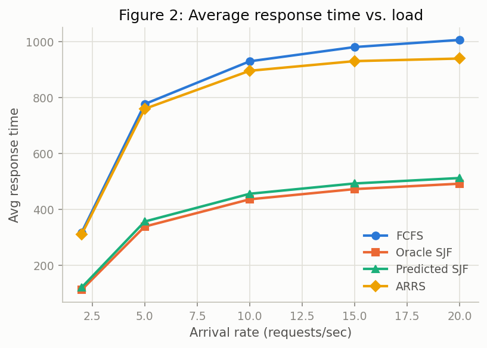
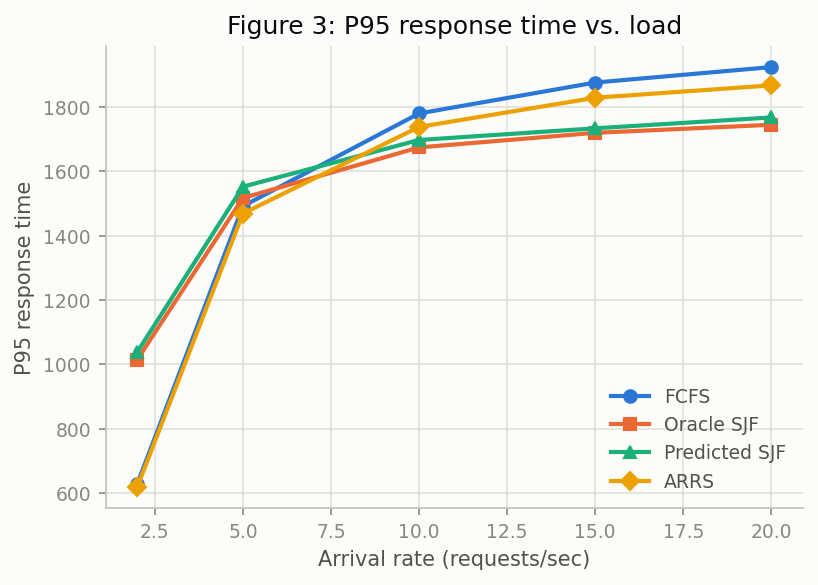
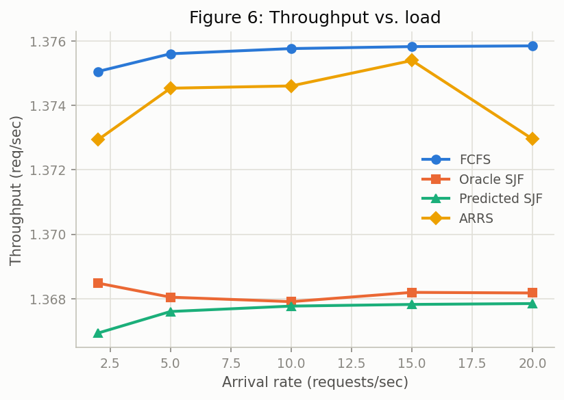
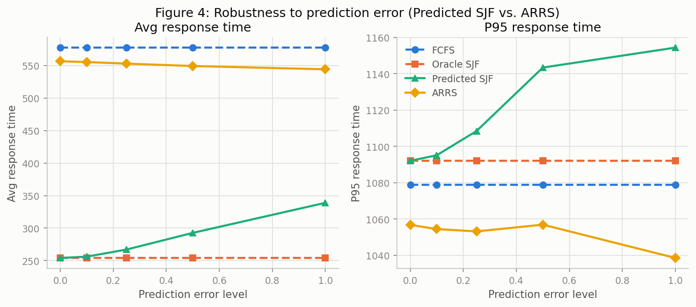
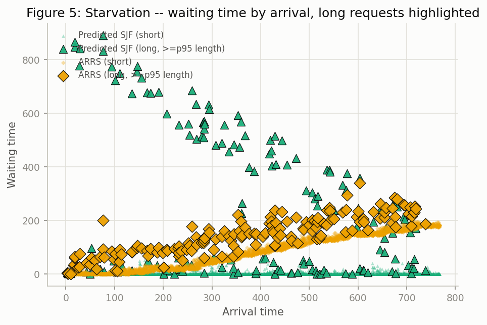

# 实验结果报告（Checkpoint）

Phase 1-5 全部跑完后的第一版结果汇总。核心问题：output length 预测存在误差和不确定性时，ARRS 是否比 SJF / Predicted-SJF 更能降低平均 latency，同时避免长请求被长期饿死？

## 实验设置

- 数据来源：LMSYS-Chat-1M，抽样 2 万条对话，按 assistant 回复拆分成 40395 条样本，`word_count` 作为 output length，截断超过 3072 词（≈4096 token）的 25 条异常值（详见 [Week2_3_Plan.md](Week2_3_Plan.md) 第四节）
- 到达过程：Poisson，`max_batch_size=8`，`decode_time_per_step=0.05`
- 4 个 scheduler：FCFS / Oracle SJF（上界参照）/ Predicted SJF / ARRS（`alpha=1.0, beta=0.2`，固定不自适应）
- 预测误差模型：乘性噪声 `predicted = true×(1+ε)`，`ε~N(0, error_level²)`（**已知问题，见"待办"一节**）

---

## Figure 1: LMSYS 长度分布

40395 个样本，median=89 词，p95=323，p99=438，长尾一直延伸到接近 3000 词。符合"少量短请求占主导、少量长请求拖尾"的真实 LLM workload 特征，Figure 5 的 starvation 实验就是利用这个真实长尾构造的。

---

## Figure 2/3/6: 整体性能（Exp1 + Exp3）

Exp1（`experiments/exp1_overall_performance.csv`，3 档负载）额外算出的 fairness（Jain's index，基于 waiting_time）：

| scheduler | rps=2 | rps=5 | rps=10 |
|---|---|---|---|
| FCFS | 0.752 | 0.752 | 0.752 |
| Oracle SJF | 0.111 | 0.301 | 0.377 |
| Predicted SJF | 0.120 | 0.315 | 0.387 |
| ARRS | **0.733** | **0.734** | **0.730** |

**结论**：

- avg/p95 response time 上，Oracle/Predicted SJF 明显优于 FCFS，ARRS 介于两者之间——用一部分平均延迟换 fairness。
- fairness 上，两种 SJF 都很差（0.11-0.39，意味着少数请求等得极久），ARRS 几乎追平 FCFS（0.73 左右）。这正是 ARRS 设计目标的直接证据：**牺牲一部分 SJF 的延迟优势，换来接近 FCFS 的公平性**。
- Figure 6（throughput）四条线几乎重合（差异在小数点后三位）——这是预期内的结果，不是 bug：只要调度策略不让 batch 空闲（4 个都是 work-conserving），总完成时间/总吞吐量在理论上应该跟调度顺序无关，调度顺序只决定"谁等得久"，不决定"总共处理了多少"。这张图本身反过来证明了：4 个 scheduler 的差异必须去 latency/fairness 指标里看，throughput 看不出来。

---

## Figure 4: 预测误差鲁棒性（Exp2，核心实验）

| error_level | Predicted SJF avg | ARRS avg | Predicted SJF p95 | ARRS p95 |
|---|---|---|---|---|
| 0.0 | 254.1 | 556.5 | 1092.1 | 1056.8 |
| 0.25 | 267.0 | 552.8 | 1108.5 | 1053.2 |
| 0.50 | 292.7 | 549.2 | 1143.4 | 1056.9 |
| 1.00 | 338.9 | 544.1 | 1154.4 | 1038.6 |

**结论**：Predicted SJF 随误差单调恶化（avg 254→339，+33%），且恶化速度递增（不是线性）；ARRS 几乎不受影响（556→544，反而略降，属于噪声范围）。这是最支持"ARRS 更鲁棒"论点的一张图。

**已知问题（不影响这张图的结论方向,但影响其说服力）**：当前误差模型是乘性噪声，`error_level` 继续调大（>1.0）不会让 Predicted SJF 进一步退化——这是数学上的饱和现象（详见 [Week2_3_Plan.md 第九节](Week2_3_Plan.md#九借鉴-tie-论文zheng-et-al-2026-arxiv260400499的修改方案)），所以 Predicted SJF 在 error=1.0 时（338.9）离 FCFS（577.5）还很远。计划改成加性噪声修复这一点，让"预测误差足够大时应该退化到 FCFS 附近"这个理论预期能被观察到。

---

## Figure 5: Starvation（Exp4）

汇总指标（`experiments/exp4_starvation_summary.csv`，bimodal workload：95% 短请求 + 5% 长请求，`arrival_rate=4`，`max_batch_size=8`，`alpha=0.3, beta=0.1`）：

| scheduler | max_wait | p95_wait | avg_wait |
|---|---|---|---|
| Predicted SJF | 890.8 | 25.1 | 15.6 |
| ARRS | 339.6 | 181.6 | 85.1 |

**结论**：ARRS 把最坏情况等待时间砍掉 62%（890.8→339.6）。图上很直观：Predicted SJF 下的长请求（绿色大三角）随时间推移越等越久,一直往上爬,没有上界;ARRS 下的长请求（橙色大菱形）被压在一个明显更低的带状区域里,不会无限增长。代价是短请求的 avg/p95_wait 有所上升——典型的 aging 类算法 tradeoff（用平均情况的一部分延迟,换最坏情况的保证）,不是缺陷。

---

## 待办（下一步，见 [Week2_3_Plan.md 第九节](Week2_3_Plan.md)）

1. `predictor.py` 改成加性噪声，修复上面提到的"乘性噪声饱和"问题
2. `arrs.py` 的 `alpha` 改成随拥堵程度（`len(waiting)/max_batch_size`）自适应，目标是让 Figure 5 里短请求的 avg_wait 涨幅更小（这次固定 `alpha=0.3` 已经是调过的相对温和版本，但仍有代价）
3. Exp4 补一条 `arrs-adaptive` 对比线
4. 报告里引用 TIE 论文（arXiv:2604.00499）的 consistency/robustness 框架，把 Figure 4 的论述接上学界的理论语言
